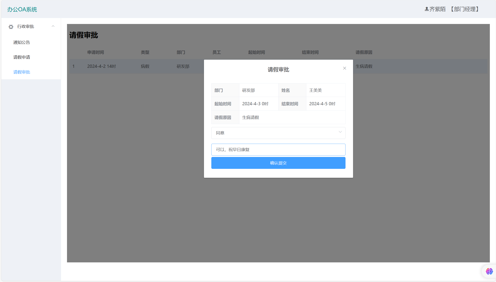

# 🏢办公自动化OA系统
> 办公自动化系统（Office Automation）是替代传统办公的解决方案
> OA系统是利用软件技术构建的单位内部办公平台，用于辅助办公
> 利用OA系统可将办公系统数字化，可极大提高办公流程执行效率

## 用户登陆界面

## 行政审批页面
> 对于低等级部门的人员是没有批假功能的
> 低等级部门所拥有的功能是查看请假公告以及申请假期

> 只有中高级部门有权利给下级部门批假的权利

